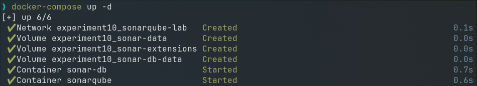
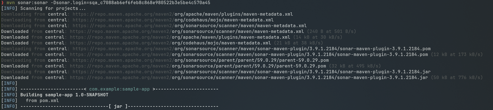
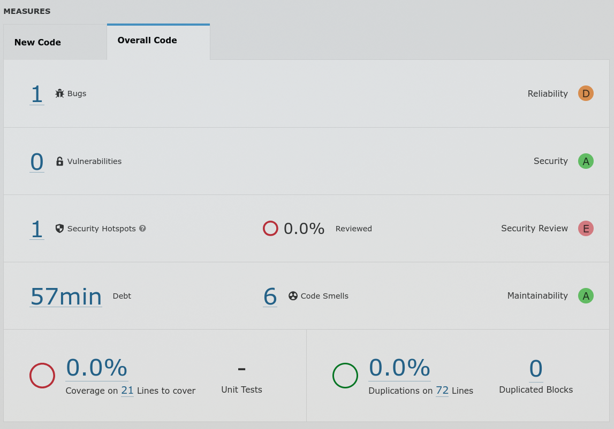

# Experiment 10: SonarQube — Static Code Analysis

### Step 1: Start the SonarQube Server

We will use Docker Compose to start both the SonarQube server and its PostgreSQL database together.

Create a file called `docker-compose.yml`:

```yaml
# docker-compose.yml
# This file starts two containers:
#   1. sonar-db     → PostgreSQL database (stores SonarQube data)
#   2. sonarqube    → The SonarQube server (web UI + analysis engine)
services:

  # ── Database ──────────────────────────────────────────────
  sonar-db:
    image: postgres:13
    container_name: sonar-db
    environment:
      POSTGRES_USER: sonar          # DB username
      POSTGRES_PASSWORD: sonar      # DB password
      POSTGRES_DB: sonarqube        # DB name
      POSTGRES_HOST_AUTH_METHOD: trust  # allow connections without password (for simplicity in this lab) 
    volumes:
      - sonar-db-data:/var/lib/postgresql/data   # persist data across restarts
    networks:
      - sonarqube-lab

  # ── SonarQube Server ──────────────────────────────────────
  sonarqube:
    image: sonarqube:lts-community
    container_name: sonarqube
    ports:
      - "9000:9000"                 # access dashboard at http://localhost:9000
    environment:
      SONAR_JDBC_URL: jdbc:postgresql://sonar-db:5432/sonarqube
      SONAR_JDBC_USERNAME: sonar
      SONAR_JDBC_PASSWORD: sonar
    volumes:
      - sonar-data:/opt/sonarqube/data
      - sonar-extensions:/opt/sonarqube/extensions
    depends_on:
      - sonar-db                    # wait for DB to start first
    networks:
      - sonarqube-lab

# Named volumes (Docker manages storage location)
volumes:
  sonar-db-data:
  sonar-data:
  sonar-extensions:

# Isolated network so containers can talk to each other by name
networks:
  sonarqube-lab:
    driver: bridge
```

Start both containers:

```bash
docker-compose up -d

# Watch the logs until you see "SonarQube is up"
docker-compose logs -f sonarqube
```



Once started, open `http://localhost:9000` in your browser.
Default login: **admin / admin** (you will be asked to change this on first login).


### Step 2: Create a Sample Java App with Code Issues

```bash
mkdir -p sample-java-app/src/main/java/com/example
cd sample-java-app
```
Create `src/main/java/com/example/Calculator.java`:
```java
package com.example;

public class Calculator {

    // ── BUG: Division by zero is not handled ──────────────
    // If someone calls divide(5, 0), this will crash at runtime.
    public int divide(int a, int b) {
        return a / b;
    }

    // ── CODE SMELL: Unused variable ────────────────────────
    // The variable 'unused' is declared but never used.
    // SonarQube flags this as unnecessary clutter.
    public int add(int a, int b) {
        int result = a + b;
        int unused = 100;   // ← code smell: delete this line
        return result;
    }

    // ── VULNERABILITY: SQL Injection risk ─────────────────
    // Building a query by concatenating user input is dangerous.
    // An attacker could pass: "1 OR 1=1" and get all users.
    public String getUser(String userId) {
        String query = "SELECT * FROM users WHERE id = " + userId;
        return query;
    }

    // ── CODE SMELL: Duplicated code ────────────────────────
    // The two methods below do exactly the same thing.
    // This is copy-paste code and should be a single method.
    public int multiply(int a, int b) {
        int result = 0;
        for (int i = 0; i < b; i++) {
            result = result + a;
        }
        return result;
    }

    public int multiplyAlt(int a, int b) {
        int result = 0;
        for (int i = 0; i < b; i++) {
            result = result + a;   // ← exact duplicate of multiply()
        }
        return result;
    }

    // ── BUG: Null pointer risk ─────────────────────────────
    // If 'name' is null, calling .toUpperCase() will throw
    // a NullPointerException at runtime.
    public String getName(String name) {
        return name.toUpperCase();
    }

    // ── CODE SMELL: Empty catch block ─────────────────────
    // The exception is caught but silently ignored.
    // This hides errors and makes debugging very hard.
    public void riskyOperation() {
        try {
            int x = 10 / 0;
        } catch (Exception e) {
            // ← never leave catch blocks empty
        }
    }
}
```

Create `pom.xml` (Maven build file):
```xml
<?xml version="1.0" encoding="UTF-8"?>
<project xmlns="http://maven.apache.org/POM/4.0.0"
         xmlns:xsi="http://www.w3.org/2001/XMLSchema-instance"
         xsi:schemaLocation="http://maven.apache.org/POM/4.0.0
         http://maven.apache.org/xsd/maven-4.0.0.xsd">

    <modelVersion>4.0.0</modelVersion>

    <!-- Project identity -->
    <groupId>com.example</groupId>
    <artifactId>sample-app</artifactId>
    <version>1.0-SNAPSHOT</version>

    <properties>
        <maven.compiler.source>11</maven.compiler.source>
        <maven.compiler.target>11</maven.compiler.target>

        <!-- SonarQube connection settings -->
        <sonar.projectKey>sample-java-app</sonar.projectKey>
        <sonar.host.url>http://localhost:9000</sonar.host.url>
        <!-- Replace with your actual token (generated in Step 3) -->
        <sonar.login>YOUR_TOKEN_HERE</sonar.login>
    </properties>

    <dependencies>
        <!-- JUnit for unit tests -->
        <dependency>
            <groupId>junit</groupId>
            <artifactId>junit</artifactId>
            <version>4.13.2</version>
            <scope>test</scope>
        </dependency>
    </dependencies>

    <build>
        <plugins>
            <!-- This plugin lets us run: mvn sonar:sonar -->
            <plugin>
                <groupId>org.sonarsource.scanner.maven</groupId>
                <artifactId>sonar-maven-plugin</artifactId>
                <version>3.9.1.2184</version>
            </plugin>
        </plugins>
    </build>

</project>
```

### Step 3: Generate a Token (Manual UI Step)

The Scanner needs a token to authenticate with the server. You generate this in the web UI.

```
1. Open http://localhost:9000
2. Log in as admin
3. Click your user icon (top right) → "My Account"
4. Click the "Security" tab
5. Under "Generate Tokens", type a name: scanner-token
6. Click "Generate"
7. Copy the token immediately — it is shown only once!
```

### Step 4: Run the Scanner

There are two ways to run the scanner. Pick the one that matches your setup.

#### Using the Maven Plugin (recommended for Java)

```bash
# Make sure you are inside the sample-java-app folder
cd sample-java-app

# Run the SonarQube analysis via Maven
# Replace YOUR_TOKEN with the token copied in Step 3
mvn sonar:sonar -Dsonar.login=YOUR_TOKEN
```



### Step 5: View Results

```
http://localhost:9000/dashboard?id=sample-java-app
```

