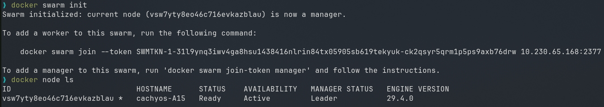
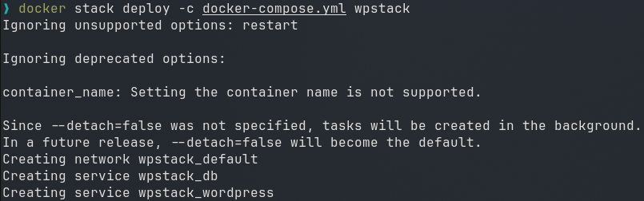
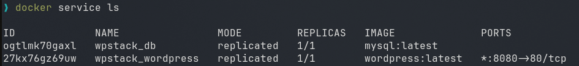
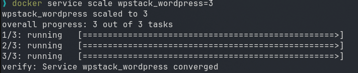
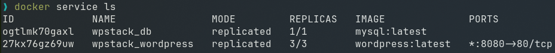

# Experiment 11: Orchestration using Docker Compose & Docker Swarm


## Prerequisites

- Docker installed (with Swarm mode enabled)
- The `docker-compose.yml` file from Experiment 6 (WordPress + MySQL)


```yaml
services:
  db:
    image: mysql:latest
    container_name: wordpress_db
    restart: always
    environment:
      MYSQL_ROOT_PASSWORD: rootpass
      MYSQL_DATABASE: wordpress
      MYSQL_USER: wpuser
      MYSQL_PASSWORD: wppass
    volumes:
      - db_data:/var/lib/mysql

  wordpress:
    image: wordpress:latest
    container_name: wordpress_app
    depends_on:
      - db
    ports:
      - "8080:80"
    restart: always
    environment:
      WORDPRESS_DB_HOST: db:3306
      WORDPRESS_DB_USER: wpuser
      WORDPRESS_DB_PASSWORD: wppass
      WORDPRESS_DB_NAME: wordpress
    volumes:
      - wp_data:/var/www/html

volumes:
  db_data:
  wp_data:
```

## Task 1: Check Current State (No Swarm)

```bash
docker compose down -v

docker ps
```

## Task 2: Initialize Docker Swarm

```bash
docker swarm init
```


**Verify Swarm is active:**

```bash
docker node ls
```



## Task 3: Deploy as a Stack (Not Just Compose)
```bash
docker stack deploy -c docker-compose.yml wpstack
```


## Task 4: Verify the Deployment

### List all services in the stack:

```bash
docker service ls
```



```bash
docker service ps wpstack_wordpress
```

## Task 5: Access WordPress

Open your browser:

```
http://localhost:8080
```

## Task 6: Scale the Application (Swarm's Superpower)

### Scale WordPress from 1 to 3 replicas:

```bash
docker service scale wpstack_wordpress=3
```



### Verify scaling:

```bash
docker service ls
```



Notice the REPLICAS column shows `3/3` for wordpress.


# Quick Reference Card

```bash
# Initialize Swarm
docker swarm init

# Deploy stack
docker stack deploy -c docker-compose.yml <stack-name>

# List services
docker service ls

# Scale service
docker service scale <stack-name_service-name>=<replicas>

# See service tasks
docker service ps <service-name>

# Remove stack
docker stack rm <stack-name>

# Leave Swarm (if needed)
docker swarm leave --force
```
