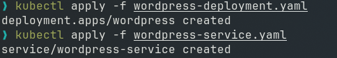
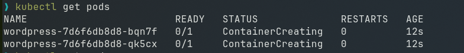
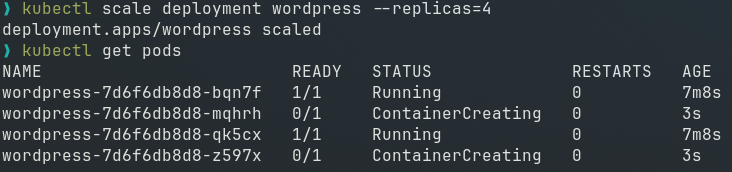

# Experiment 12: Study and Analyse Container Orchestration using Kubernetes

## Task 1: Create a Deployment

### Step 1: Create a file `wordpress-deployment.yaml`

```yaml
# wordpress-deployment.yaml
apiVersion: apps/v1          # Which Kubernetes API to use
kind: Deployment             # Type of resource
metadata:
  name: wordpress            # Name of this deployment
spec:
  replicas: 2                # Run 2 identical pods
  selector:
    matchLabels:
      app: wordpress         # Pods with this label belong to this deployment
  template:                  # Template for the pods
    metadata:
      labels:
        app: wordpress       # Label applied to each pod
    spec:
      containers:
      - name: wordpress
        image: wordpress:latest   # Docker image
        ports:
        - containerPort: 80       # Port inside the container
```

### Step 2: Apply the deployment

```bash
kubectl apply -f wordpress-deployment.yaml
```

## Task 2: Expose the Deployment as a Service

### Step 1: Create a file `wordpress-service.yaml`

```yaml
# wordpress-service.yaml
apiVersion: v1
kind: Service
metadata:
  name: wordpress-service
spec:
  type: NodePort            # Exposes service on a port of each node (VM)
  selector:
    app: wordpress          # Send traffic to pods with this label
  ports:
    - port: 80              # Service port
      targetPort: 80        # Pod port
      nodePort: 30007       # External port (range: 30000–32767)
```

### Step 2: Apply the service

```bash
kubectl apply -f wordpress-service.yaml
```



## Task 3: Verify Everything

Check if pods are running:
```bash
kubectl get pods
```




## Task 4: Scale the Deployment

Increase the number of pods from 2 to 4:

```bash
kubectl scale deployment wordpress --replicas=4
```

Verify:
```bash
kubectl get pods
```


