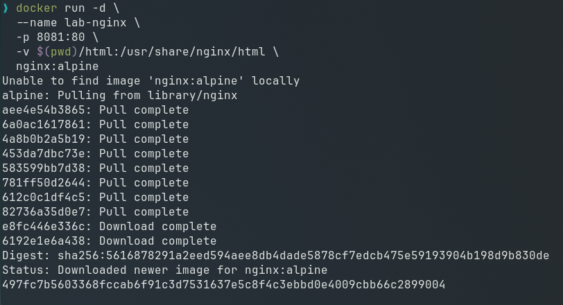
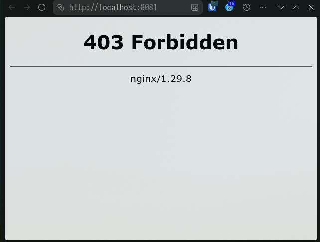
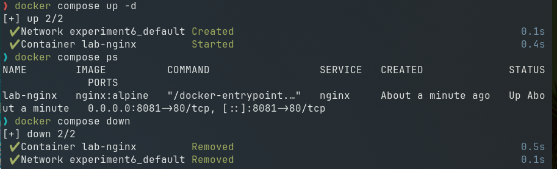
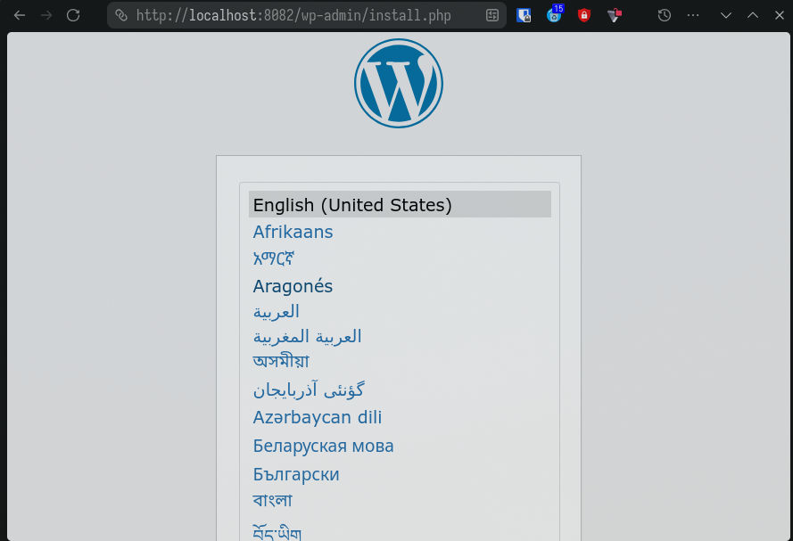

# Experiment 6: Comparison of Docker Run and Docker Compose

# A. Theory

## 1. Objective

To understand the relationship between `docker run` and Docker Compose, and to compare their configuration syntax and use cases.

## 2. Background Theory

### 2.1 Docker Run (Imperative Approach)

The `docker run` command is used to create and start a container from an image. It requires explicit flags for:

* Port mapping (`-p`)
* Volume mounting (`-v`)
* Environment variables (`-e`)
* Network configuration (`--network`)
* Restart policies (`--restart`)
* Resource limits (`--memory`, `--cpus`)
* Container name (`--name`)

This approach is **imperative**, meaning you specify step-by-step instructions.

Example:

```bash
docker run -d \
  --name my-nginx \
  -p 8080:80 \
  -v ./html:/usr/share/nginx/html \
  -e NGINX_HOST=localhost \
  --restart unless-stopped \
  nginx:alpine
```

### 2.2 Docker Compose (Declarative Approach)

Docker Compose uses a YAML file (`docker-compose.yml`) to define services, networks, and volumes in a structured format.

Instead of multiple `docker run` commands, a single command is used:

```bash
docker compose up -d
```

Compose is **declarative**, meaning you define the desired state of the application.

Equivalent Compose file:

```yaml
services:
  nginx:
    image: nginx:alpine
    container_name: my-nginx
    ports:
      - "8080:80"
    volumes:
      - ./html:/usr/share/nginx/html
    environment:
      NGINX_HOST: localhost
    restart: unless-stopped
```

## 3. Mapping: Docker Run vs Docker Compose

| Docker Run Flag     | Docker Compose Equivalent        |
| ------------------- | -------------------------------- |
| `-p 8080:80`        | `ports:`                         |
| `-v host:container` | `volumes:`                       |
| `-e KEY=value`      | `environment:`                   |
| `--name`            | `container_name:`                |
| `--network`         | `networks:`                      |
| `--restart`         | `restart:`                       |
| `--memory`          | `deploy.resources.limits.memory` |
| `--cpus`            | `deploy.resources.limits.cpus`   |
| `-d`                | `docker compose up -d`           |


## 4. Advantages of Docker Compose

1. Simplifies multi-container applications
2. Provides reproducibility
3. Version controllable configuration
4. Unified lifecycle management
5. Supports service scaling

Example:

```bash
docker compose up --scale web=3
```


# B. TASK

## Task 1: Single Container Comparison

### Step 1: Run Nginx Using Docker Run

Execute:

```bash
docker run -d \
  --name lab-nginx \
  -p 8081:80 \
  -v $(pwd)/html:/usr/share/nginx/html \
  nginx:alpine
```



Verify:
```bash
docker ps
```

Access:
```
http://localhost:8081
```


Stop and remove container:

```bash
docker stop lab-nginx
docker rm lab-nginx
```


### Step 2: Run Same Setup Using Docker Compose

Create `docker-compose.yml`:

```yaml
services:
  nginx:
    image: nginx:alpine
    container_name: lab-nginx
    ports:
      - "8081:80"
    volumes:
      - ./html:/usr/share/nginx/html
```

Run:

```bash
docker compose up -d
```

Verify:

```bash
docker compose ps
```

Stop:

```bash
docker compose down
```



## Task 2: Multi-Container Application

### Objective:

Deploy WordPress with MySQL using:

1. Docker Run (manual way)
2. Docker Compose (structured way)


### A. Using Docker Run

1. Create network:

```bash
docker network create wp-net
```

2. Run MySQL:

```bash
docker run -d \
  --name mysql \
  --network wp-net \
  -e MYSQL_DATABASE=wordpress \
  -e MYSQL_USER=wpuser \
  -e MYSQL_PASSWORD=secret \
  -e MYSQL_ROOT_PASSWORD=rootpass \
  mysql:latest
```

3. Run WordPress:

```bash
docker run -d \
  --name wordpress \
  --network wp-net \
  -p 8082:80 \
  -e WORDPRESS_DB_HOST=mysql \
  -e WORDPRESS_DB_NAME=wordpress \
  -e WORDPRESS_DB_USER=wpuser \
  -e WORDPRESS_DB_PASSWORD=secret \
  wordpress:latest
```

Test:

```
http://localhost:8082
```

### B. Using Docker Compose

Create `docker-compose.yml`:

```yaml
services:
  mysql:
    image: mysql:latest
    container_name: mysql
    environment:
      MYSQL_ROOT_PASSWORD: secret
      MYSQL_DATABASE: ${MYSQL_DATABASE}
      MYSQL_USER: ${MYSQL_USER}
      MYSQL_PASSWORD: ${MYSQL_PASSWORD}
    volumes:
      - mysql_data:/var/lib/mysql
    networks:
      - wordpress-network

  wordpress:
    image: wordpress:latest
    container_name: wordpress # Remove to scale
    ports:
      - "8082:80"
    environment:
      WORDPRESS_DB_HOST: mysql
      WORDPRESS_DB_NAME: ${MYSQL_DATABASE}
      WORDPRESS_DB_USER: ${MYSQL_USER}
      WORDPRESS_DB_PASSWORD: ${MYSQL_PASSWORD}
    depends_on:
      - mysql
    networks:
      - wordpress-network

volumes:
  mysql_data:

networks:
  wp-network:
```

Run:

```bash
docker compose up -d
```



Stop:

```bash
docker compose down -v
```