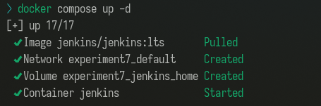
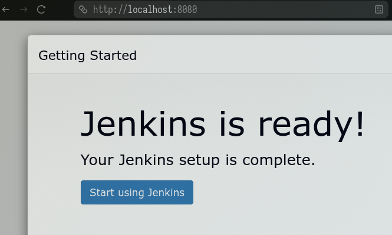
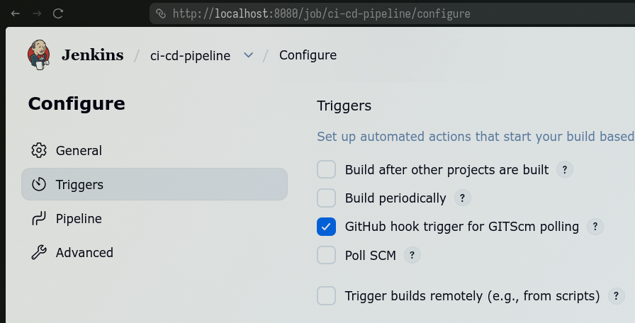
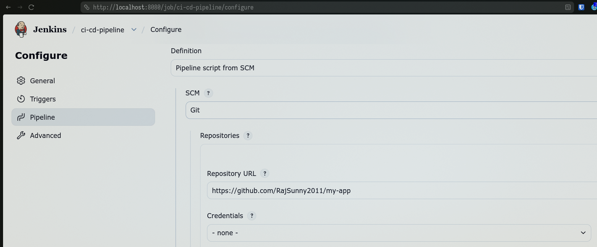
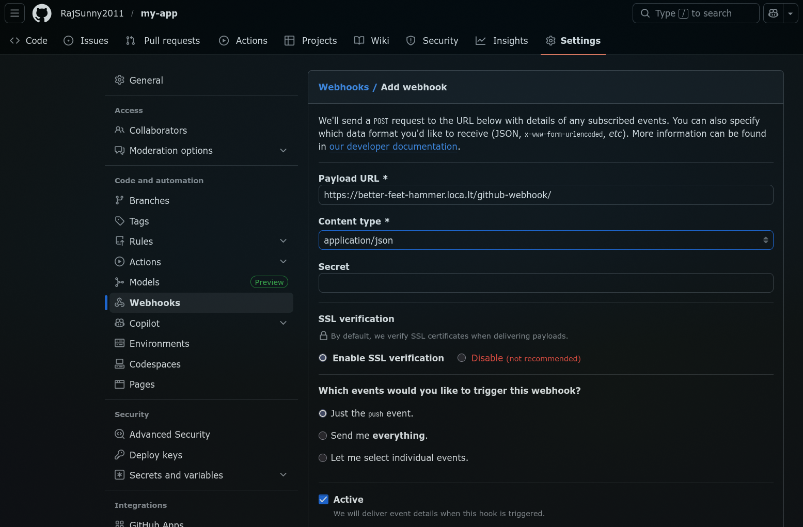
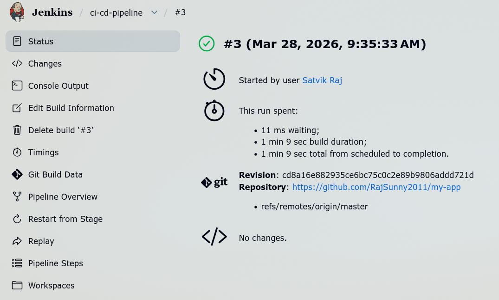
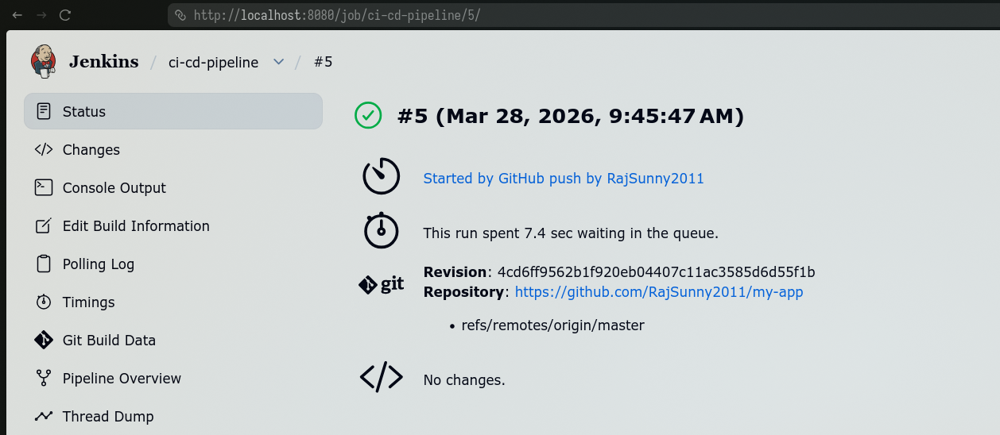

## **Lab Experiment 7: CI/CD using Jenkins, GitHub and Docker Hub**

## **1. Aim**

To design and implement a complete CI/CD pipeline using **Jenkins**, integrating source code from **GitHub**, and building & pushing Docker images to **Docker Hub**.

## **2. Objectives**

* Understand CI/CD workflow using Jenkins (GUI-based tool)
* Create a structured GitHub repository with application + Jenkinsfile
* Build Docker images from source code
* Securely store Docker Hub credentials in Jenkins
* Automate build & push process using webhook triggers
* Use same host (Docker) as Jenkins agent


## **3. Theory**

### **What is Jenkins?**

Jenkins is a **web-based GUI automation server** used to:

* Build applications
* Test code
* Deploy software

It provides:

* Dashboard (browser-based UI)
* Plugin ecosystem (GitHub, Docker, etc.)
* Pipeline as Code using `Jenkinsfile`


### **What is CI/CD?**

* **Continuous Integration (CI):**
  Code is automatically built and tested after each commit

* **Continuous Deployment (CD):**
  Built artifacts (Docker images) are automatically delivered/deployed


### **Workflow Overview**

```
Developer → GitHub → Webhook → Jenkins → Build → Docker Hub
```

## **4. Prerequisites**

* Docker & Docker Compose installed
* GitHub account
* Docker Hub account
* Basic Linux command knowledge

## **5. Part A: GitHub Repository Setup (Source Code + Build Definition)**


### **5.1 Application Code**

#### 1. `app.py`

```python
from flask import Flask
app = Flask(__name__)

@app.route("/")
def home():
    return "Hello from CI/CD Pipeline!"
    # return "Hello from CI/CD Pipeline!, my sapid is 500119624"

app.run(host="0.0.0.0", port=8000)
```

#### 2. `requirements.txt`

```
blinker==1.9.0
click==8.3.1
Flask==3.1.3
itsdangerous==2.2.0
Jinja2==3.1.6
MarkupSafe==3.0.3
Werkzeug==3.1.7
```

### **5.2 Dockerfile (Build Process)**

```dockerfile
FROM python:3.13-slim

WORKDIR /app
COPY . .

RUN pip install -r requirements.txt

EXPOSE 80
CMD ["python", "app.py"]
```

### **5.3 Jenkinsfile (Pipeline Definition in GitHub)**

```groovy
pipeline {
    agent any

    environment {
        IMAGE_NAME = "rajsunny004/myapp"
    }

    stages {

        stage('Clone Source') {
            steps {
                git 'https://github.com/RajSunny2011/my-app.git'
            }
        }

        stage('Build Docker Image') {
            steps {
                sh 'docker build -t $IMAGE_NAME:$BUILD_NUMBER -t $IMAGE_NAME:latest .'
            }
        }

        stage('Login to Docker Hub') {
            steps {
                withCredentials([string(credentialsId: 'dockerhub-token', variable: 'DOCKER_TOKEN')]) {
                    sh 'echo $DOCKER_TOKEN | docker login -u rajsunny004 --password-stdin'
                }
            }
        }

        stage('Push to Docker Hub') {
            steps {
                sh 'docker push $IMAGE_NAME:$BUILD_NUMBER'
                sh 'docker push $IMAGE_NAME:latest'
            }
        }
    }
}
```

## **6. Part B: Jenkins Setup using Docker (Persistent Configuration)**

### **6.1 Create Docker Compose File**

```yaml
services:
  jenkins:
    image: jenkins/jenkins:lts
    container_name: jenkins
    restart: always
    ports:
      - "8080:8080"
      - "50000:50000"
    volumes:
      - jenkins_home:/var/jenkins_home
      - /var/run/docker.sock:/var/run/docker.sock
    user: root

volumes:
  jenkins_home:
```

### **6.2 Start Jenkins**

```bash"
docker-compose up -d
```



Access:

```
http://localhost:8080
```



### **6.3 Unlock Jenkins**

```bash
docker exec -it jenkins cat /var/jenkins_home/secrets/initialAdminPassword
```

## **7. Part C: Jenkins Configuration**


### **7.1 Add Docker Hub Credentials**

Path:

```
Manage Jenkins → Credentials → Add Credentials
```

* Type: Secret Text
* ID: `dockerhub-token`
* Value: Docker Hub Access Token


### **7.2 Create Pipeline Job**

1. New Item → Pipeline
2. Name: `ci-cd-pipeline`

Configure:

```
Pipeline script from SCM
```

* SCM: Git
* Repo URL: your GitHub repo
* Script Path: `Jenkinsfile`




## **8. Part D: GitHub Webhook Integration**

### **8.1 Configure Webhook**

In GitHub:

```
Settings → Webhooks → Add Webhook
```

Payload URL:

```
http://<your-server-ip>:8080/github-webhook/
```

Events:

```
Push events
```



## Result:




