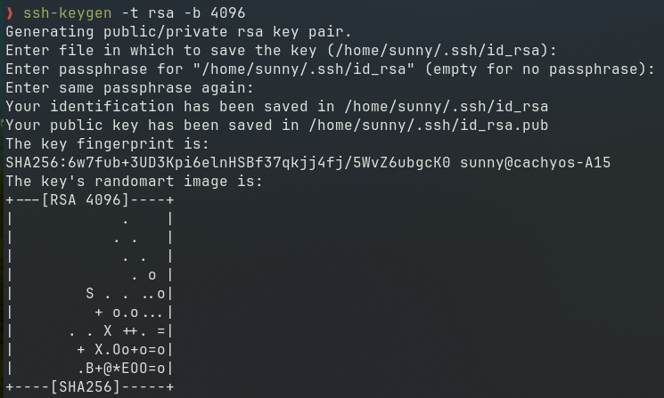
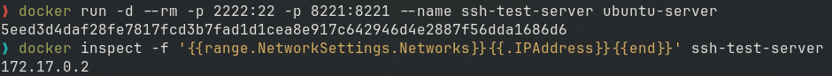
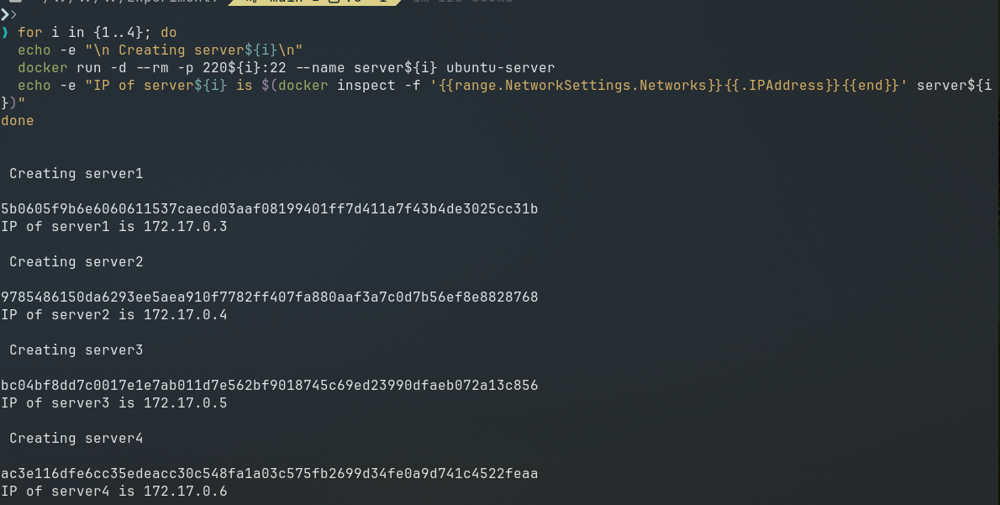
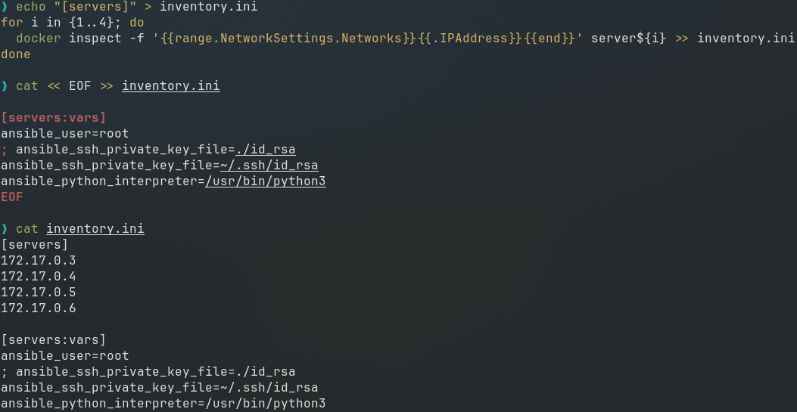
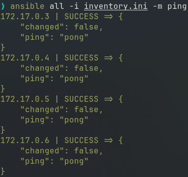
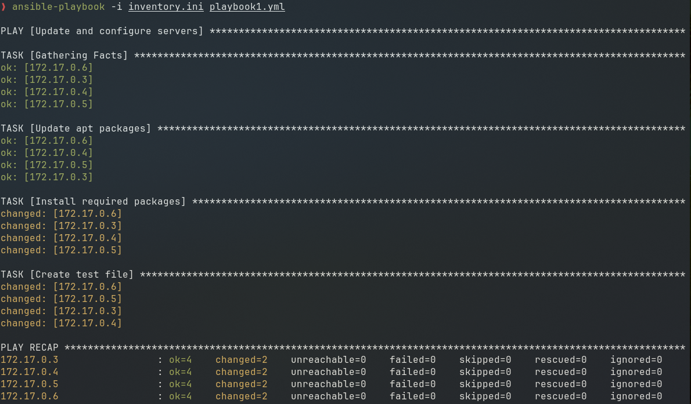
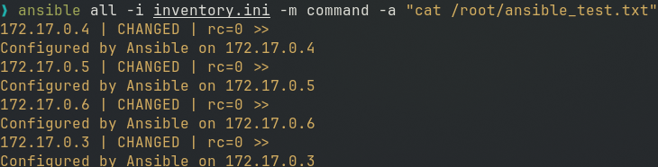

# Experiment 9 : Ansible

## Theory

**Problem Statement:**
Managing infrastructure manually across multiple servers leads to configuration drift, inconsistent environments, and time-consuming repetitive tasks. Scaling from one server to hundreds becomes nearly impossible with manual SSH-based administration.

### **What is Ansible?**
- Ansible is an open-source **automation tool** for **configuration management**, **application deployment**, and **orchestration**.
- It follows an **agentless** architecture, using SSH for Linux and WinRM for Windows.
- Uses YAML-based **playbooks** to define automation tasks.


### **How Ansible Solves the Problem:**
- **Agentless Architecture**: No software installation required on managed nodes
- **Idempotency**: Running playbooks multiple times yields same result
- **Declarative Syntax**: Describe desired state, not the steps to achieve it
- **Push-based**: Initiates changes from control node immediately

### **Key Concepts**
| Component         | Description                                                                       |
| :---------------- | :-------------------------------------------------------------------------------- |
| **Control Node**  | Machine with Ansible installed                                                    |
| **Managed Nodes** | Target servers (no Ansible agent needed)                                          |
| **Inventory**     | Defines the list of managed nodes (EC2 instances, servers, etc.). `inventory.ini` |
| **Playbooks**     | YAML files containing a sequence of automation steps.                             |
| **Tasks**         | Individual actions in playbooks (e.g., installing a package).                     |
| **Modules**       | Built-in functionality to perform tasks (e.g., `yum`, `apt`, `service`).          |
| **Roles**         | Pre-defined reusable automation scripts.                                          |


### How does Ansible work?

Ansible uses the concepts of control and managed nodes. It connects from the **control node**, any machine with Ansible installed, to the **managed nodes** sending commands and instructions to them.
The units of code that Ansible executes on the managed nodes are called **modules**. Each module is invoked by a **task**, and an ordered list of tasks together forms a **playbook.** Users write playbooks with tasks and modules to define the desired state of the system.
The managed machines are represented in a simplistic **inventory** file that groups all the nodes into different categories.
Ansible leverages a very simple language, [YAML](https://docs.ansible.com/ansible/latest/reference_appendices/YAMLSyntax.html), to define playbooks in a human-readable data format that is really easy to understand from day one.


### Benefits of using Ansible

*   A free and open-source community project with a huge audience.
*   Battle-tested over many years as the preferred tool of IT wizards.
*   Easy to start and use from day one, without the need for any special coding skills.
*   Simple deployment workflow without any extra agents.
*   Includes some sophisticated features around modularity and reusability that come in handy as users become more proficient.
*   Extensive and comprehensive official documentation that is complemented by a plethora of online material produced by its community.


## Part A

### **Ansible Installation Instructions**  

#### **1. Install via `pip` (Python Package Manager)**  
```bash
# Install Ansible globally
pip install ansible

# Verify installation
ansible --version
```
**Best for**: Latest versions, macOS/Linux, or Python environments.  

#### **2. Install via `apt` (Debian/Ubuntu)**  

```bash
# Update packages
sudo apt update -y

# Install Ansible
sudo apt install ansible -y

# Verify
ansible --version
```

# Create Docker image and test ssh login

> First create ssh key-pair and then create custom ubuntu-server image with open-ssh configured.

## Testing SSH Key Pair Login with Docker and WSL


## 1. Create SSH Key Pair

First, generate an SSH key pair:

```bash
# Generate RSA key pair (accept defaults when prompted)
ssh-keygen -t rsa -b 4096

# This creates:
# Private key: ~/.ssh/id_rsa
# Public key: ~/.ssh/id_rsa.pub
# copy keys to current directory to be added to docker images
cp ~/.ssh/id_rsa.pub .
cp ~/.ssh/id_rsa .
```




## 2. Create Dockerfile for Ubuntu SSH Server

Create a Dockerfile with the following content:

```dockerfile
FROM ubuntu


RUN apt update -y
RUN apt install -y python3 python3-pip openssh-server
RUN mkdir -p /var/run/sshd

# Configure SSH
RUN mkdir -p /run/sshd && \
    echo 'root:password' | chpasswd && \
    sed -i 's/#PermitRootLogin prohibit-password/PermitRootLogin yes/' /etc/ssh/sshd_config && \
    sed -i 's/#PasswordAuthentication yes/PasswordAuthentication no/' /etc/ssh/sshd_config && \
    sed -i 's/#PubkeyAuthentication yes/PubkeyAuthentication yes/' /etc/ssh/sshd_config


# Create .ssh directory and set proper permissions
RUN mkdir -p /root/.ssh && \
    chmod 700 /root/.ssh

# Copy SSH keys (note: this is not secure for production!)
COPY id_rsa /root/.ssh/id_rsa
COPY id_rsa.pub /root/.ssh/authorized_keys

# Set proper permissions for keys
RUN chmod 600 /root/.ssh/id_rsa && \
    chmod 644 /root/.ssh/authorized_keys

# Fix for SSH login
RUN sed -i 's@session\s*required\s*pam_loginuid.so@session optional pam_loginuid.so@g' /etc/pam.d/sshd

# Expose SSH port
EXPOSE 22

# Start SSH service when container starts
CMD ["/usr/sbin/sshd", "-D"]
```

## 3. Build the Docker Image

```bash
# Copy your public key to the current directory
cp ~/.ssh/id_rsa.pub .

# Build the Docker image
docker build -t ubuntu-server .

# Remove the public key from build directory (optional)
rm id_rsa.pub
```

## 4. Run the Docker Container


```bash
# Run the container with port mapping
docker run -d -p --rm 2222:22 -p 8221:8221 --name ssh-test-server ubuntu-server
```

## 5. Find the Container IP Address

```bash
# Get the container's IP address
docker inspect -f '{{range.NetworkSettings.Networks}}{{.IPAddress}}{{end}}' ssh-test-server
```



## 6. Test SSH Connections

### Test password authentication:
```bash
ssh root@localhost -p 2222
# OR
ssh root@172.17.0.2 
```

### Test key-based authentication:
```bash
ssh -i ~/.ssh/id_rsa root@localhost -p 2222
```

## Clean Up

When done testing:
```bash
docker stop ssh-test
docker rm ssh-test
```


# Ansible with Docker Exercise

Using docker image `ubuntu-server` created in previous part
run 4 test servers named server1 to serve4

#### Step 1: Start multiple containers to act as server (to be configured by ansible)

```bash
for i in {1..4}; do
  echo -e "\n Creating server${i}\n"
  docker run -d --rm -p 220${i}:22 --name server${i} ubuntu-server
  echo -e "IP of server${i} is $(docker inspect -f '{{range.NetworkSettings.Networks}}{{.IPAddress}}{{end}}' server${i})"
done
```




## Step 2: Create Ansible Inventory

below script will create an update inventory.ini with updated docker container IPs, review this file and you can create your own if needed.

```bash
# Get container IPs
echo "[servers]" > inventory.ini
for i in {1..4}; do
  docker inspect -f '{{range.NetworkSettings.Networks}}{{.IPAddress}}{{end}}' server${i} >> inventory.ini
done

# Add inventory variables
cat << EOF >> inventory.ini

[servers:vars]
ansible_user=root
; ansible_ssh_private_key_file=./id_rsa
ansible_ssh_private_key_file=~/.ssh/id_rsa
ansible_python_interpreter=/usr/bin/python3
EOF
```

## Step 3: review content of inventory.ini
```bash
cat inventory.ini
```



## Step 4: Test Connectivity
```bash
# Manual SSH test
ssh -i $(pwd)/id_rsa root@172.17.0.3
## above on will work on linux and may cause problems on NTFS file systems, then try
ssh -i ~/.ssh/id_rsa root@172.17.0.3 

# Ansible ping test
ansible all -i inventory.ini -m ping
OR
ansible all -i inventory.ini -m ping -vvv
```



## Step 5: Create Playbook (update.yml)

The yaml file should start with three dash only `---`

```yaml
--- # it should start with three dash only
- name: Update and configure servers
  hosts: all
  become: yes

  tasks:
    - name: Update apt packages
      apt:
        update_cache: yes
        upgrade: dist

    - name: Install required packages
      apt:
        name: ["vim", "htop", "wget"]
        state: present

    - name: Create test file
      copy:
        dest: /root/ansible_test.txt
        content: "Configured by Ansible on {{ inventory_hostname }}"
```

## Step 6: Run Playbook
```bash
ansible-playbook -i inventory.ini playbook1.yml
```



## Step 7: Verify Changes
```bash
# Using Ansible
ansible all -i inventory.ini -m command -a "cat /root/ansible_test.txt"

# Manually via Docker
for i in {1..4}; do
  docker exec server${i} cat /root/ansible_test.txt
done
```



## Step 8: Cleanup
```bash
# Stop and remove containers
for i in {1..4}; do docker rm -f server${i}; done
```