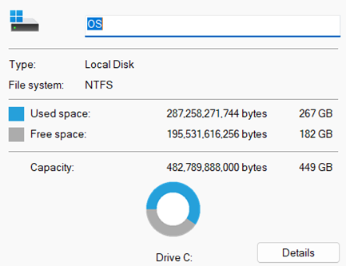
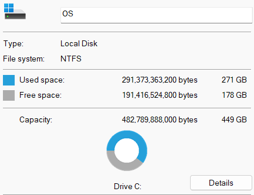

# **Containerization and DevOps Lab**

## **Experiment - 1**: Comparison of Virtual Machines (VMs) and Containers using Ubuntu and Nginx

### **Objective**
1. To understand the conceptual and practical differences between Virtual Machines and Containers.

2. To install and configure a Virtual Machine using VirtualBox and Vagrant on Windows.

3. To install and configure Containers using Docker inside WSL.

4. To deploy an Ubuntu-based Nginx web server in both environments.

5. To compare resource utilization, performance, and operational characteristics of VMs and Containers.


### **Part A: Virtual Machine**

 - Download Vagrantfile of required VM OS using `vagrant init hashicorp/bionic64` , run `vagrant up` to start up the VM and `vagrant ssh` to access the VM terminal.


 - Install nginx using `sudo apt install -y nginx` and run the service using `sudo systemctl start nginx`. Verify it by `curl localhost`.


#### **Observations**
**1. Storage Utilization:** The comparison of host disk usage before and after VM provisioning.
<table>
  <tr>
    <th><b>Pre-VM</b></th>
    <th><b>Post-VM</b></th>
    <th><b>Usage</b></th>
  </tr>
  <tr>
    <td></td>
    <td></td>
    <td><b>~4GB</b></td>
  </tr>
</table>
  
> The VM installation consumed approximately **4 GB** of disk space to store the Guest OS and virtual disk.

**2. Boot Performance:** The startup time required for the Virtual Machine to boot.
```bash
systemd-analyze
```

> The VM took **27.049 seconds** to fully boot (Kernel: 6.634s + Userspace: 20.414s), demonstrating high startup latency.

**3. Memory Usage:** Amount of RAM resources allocated to and used by the Guest OS.

```bash
free -h
```


> The VM reserved **985 MB** of total RAM from the host, with *73 MB* actively used and 670 MB used up in buffers/cache.
