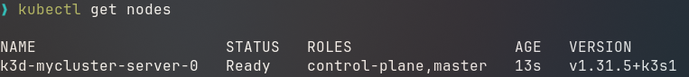
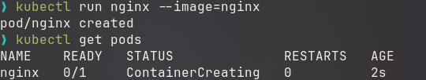
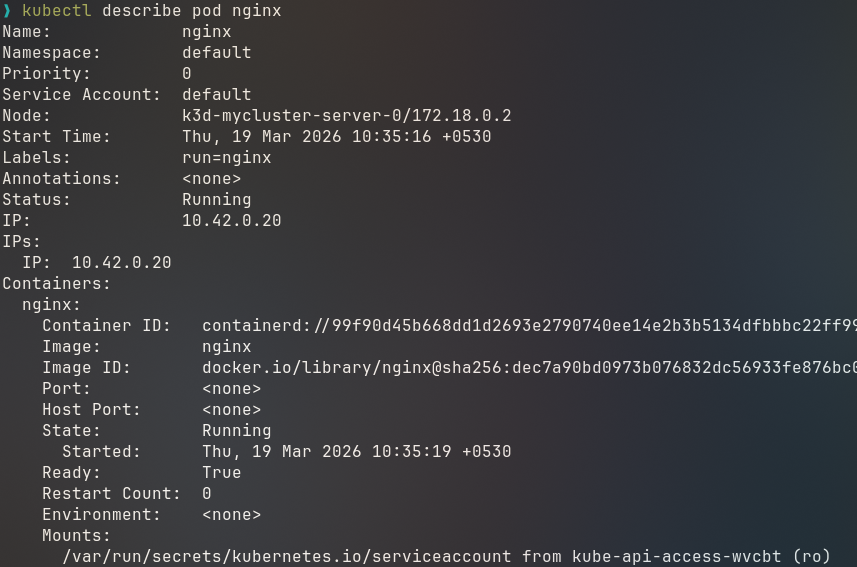
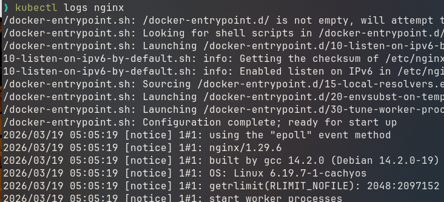
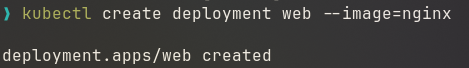
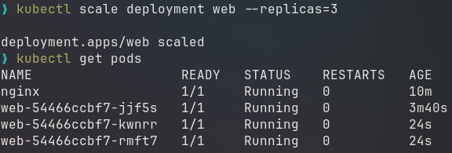
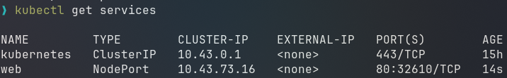

# Introduction to Kubernetes

## 1. Why Kubernetes is Needed

Kubernetes automates deployment, scaling, networking, and management of containerized applications.

## 2. Core Kubernetes Components (Conceptual Overview)

A Kubernetes cluster has two major parts.

### A: Control Plane (Master)

Responsible for managing the cluster.

Key components:
1. API Server
    - Entry point to the cluster
    - All commands go through it

2. Scheduler
    - Decides which node runs a container

3. Controller Manager
    - Ensures desired state matches actual state

4. etcd
    - Key-value database storing cluster state

### B: Worker Nodes

These run the actual containers.
1. Kubelet
    - Agent that communicates with control plane

2. Container Runtime - Docker or containerd 
    - Responsible for running containers.

3. Kube Proxy
    - Handles networking and service routing.

## 3. Tools for Running Kubernetes Locally

### Minikube

Runs a single-node Kubernetes cluster.

Features:
* Beginner friendly
* Works with Docker or VM
* Official learning tool

Limitation:
* Slightly heavy on resources.

### k3s

Lightweight Kubernetes distribution.

Features:

* Very small binary
* Reduced memory usage
* Used in edge environments

### k3d

Runs **k3s inside Docker containers**.

Advantages:
* Very fast startup
* Easy cluster creation
* Multiple clusters possible


### kind (Kubernetes in Docker)

Used mainly for testing.

Features:
* Runs Kubernetes nodes as Docker containers
* Very useful for CI/CD testing


### kubectl

The command line tool used to interact with Kubernetes clusters. kubectl is only a **client tool**.
It does not contain a cluster itself.

kubectl connects to clusters using a configuration file.

Default file location:

```
~/.kube/config
```

This tells kubectl which cluster to interact with:
```
kubectl config use-context k3d-mycluster
```

With kubectl you can:

* Create applications
* Inspect resources
* Manage deployments
* Debug clusters

---

### Task 1: View Cluster Nodes

```
kubectl get nodes
```


### Task 2 & 3: View Running Pods and Run a Container

Create a nginx pod:
```
kubectl run nginx --image=nginx
```
List running pods
```
kubectl get pods
```




### Task 4: View Pod Details

```
kubectl describe pod nginx
```


Shows:
* Events
* container information
* networking
* resource usage

Useful for debugging.

### Task 5: View Logs

```
kubectl logs nginx
```


Displays container logs.

### Task 6: Create Deployment

```
kubectl create deployment web --image=nginx
```


Deployment manages pods.

Benefits:

* automatic restart
* rolling updates
* scaling


### Task 7: Scale Application

```
kubectl scale deployment web --replicas=3
```



### Task 8: Expose Application

```
kubectl expose deployment web --port=80 --type=NodePort
```

Creates a service so the application becomes accessible.

### Task 9: List Services

```
kubectl get services
```



Shows how applications are exposed.

### Task 10: Delete Resources

```
kubectl delete pod nginx
```

or

```
kubectl delete deployment web
```

Removes resources from the cluster.


## 9. Advanced Topics (Self Study)

* Ingress (routing traffic)
* ConfigMaps
* Secrets
* Persistent storage
* Helm charts
* CI/CD with Kubernetes
