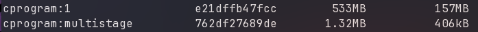
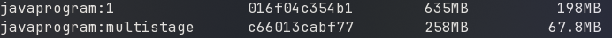

**Objective:** Create a Docker file to run a program in C and Java; implementing methods to minimize image size and compare.

C file:
```c
#include <stdio.h>

void main(){
    int sapid = 500119624;
    int val;
    while (1){
        printf("Enter SAP id: ");
        scanf("%d", &val);
        if (sapid == val) {
            printf("Matched\n");
        } else {
            printf("Not Matched\n");
        }
    }
}
```

Simple build `cprogram.Dockerfile`:
```Dockerfile
FROM ubuntu:latest
RUN apt update && apt install -y gcc
COPY app.c .
RUN gcc -static -o app app.c

CMD ["./app"]
```

Build with:
```Bash
docker build -t cprogram:1 -f cprogram.Dockerfile .
```

Multistage build `cprogram-multistage.Dockerfile`:
```Dockerfile
FROM ubuntu:latest AS builder
RUN apt update && apt install -y gcc
COPY app.c .
RUN gcc -static -o app app.c

FROM scratch
COPY --from=builder ./app ./app
CMD ["./app"]
```

Build with:
```Bash
docker build -t cprogram:multistage -f cprogram-multistage.Dockerfile .
```

Sizes:



Java File:
```Java
public class HelloWorld{
  public static void main(String[] args){
    System.out.println("Hello World");
  }
}
```

Simple Build `javaprogram.Dockerfile`:
```Dockerfile
FROM eclipse-temurin:17-jdk AS builder
WORKDIR /app
COPY HelloWorld.java .
RUN javac HelloWorld.java
CMD ["java", "HelloWorld"]
```

Build with:
```Bash
docker build -t javaprogram:1 -f javaprogram.Dockerfile .
```

Multistage build `javaprogram-multistage.Dockerfile`:
```Dockerfile
FROM eclipse-temurin:17-jdk AS builder
WORKDIR /app
COPY HelloWorld.java .
RUN javac HelloWorld.java

FROM eclipse-temurin:17-jre-alpine
WORKDIR /app
COPY --from=builder ./app/HelloWorld.class .
CMD ["java", "HelloWorld"]
```

Build with 
```Bash
docker build -t javaprogram:multistage -f javaprogram-multistage.Dockerfile .
```

