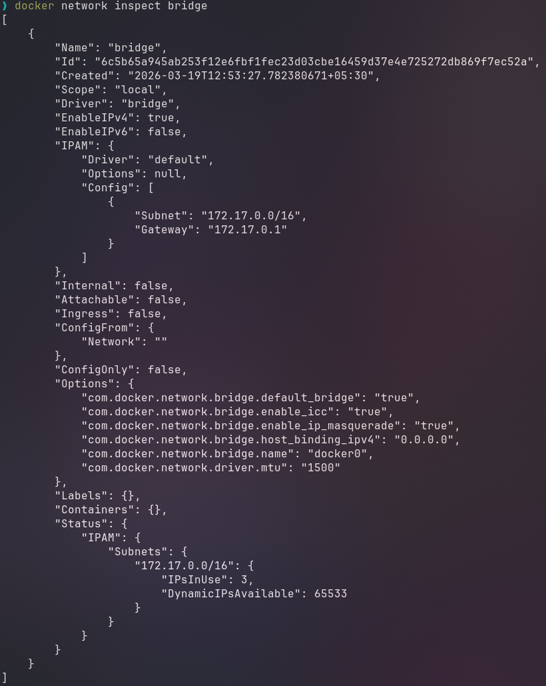
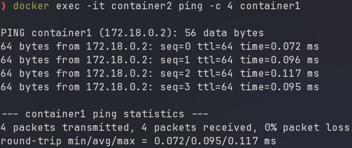

# Docker Networking – Complete Guide (Part 1: Core Concepts)

**Docker networking solves:**
- Container ↔ Container communication
- Container ↔ Host machine communication  
- Container ↔ Internet communication
- Containers on different servers talking to each other


## 2. Docker Network Drivers (The Basics)

Docker provides different types of networks (drivers) for different needs:

| Driver      | Simple Analogy                          | When to Use                               |
| ----------- | --------------------------------------- | ----------------------------------------- |
| **bridge**  | Apartment building with shared hallway  | Default for single host, most common      |
| **host**    | Living in same room as host             | Need max performance, no isolation needed |
| **overlay** | Underground tunnel connecting buildings | Multiple servers need to talk             |
| **macvlan** | Separate house with own mailbox         | Need real network IP                      |
| **none**    | Isolated room with no doors             | Complete isolation needed                 |

---

### I. Bridge Network (The Default)
A private, internal network created on a *single host* that allows containers on the network to communicate while *providing isolation from other networks* and the host system's network.

```bash
# See all networks
docker network ls
```

#### Task 1: Inspect the Default Bridge
```bash
# Look at bridge details
docker network inspect bridge
```


#### Task 2: Create Your Own Bridge (Better than default)
```bash
# Create custom bridge (like creating your own private network)
docker network create my_app_net

# Verify it exists
docker network ls

# Inspect it
docker network inspect my_app_net
```
**Why custom bridge?** It gives you automatic DNS (containers can find each other by name).

#### Task 3: Run Containers in Your Network
```bash
# Run an nginx web server
# -d = detach (run in background)
# --name = give it a name
# --network = which network to use
docker run -d --name web --network my_app_net nginx

# Run a utility container
docker run -d --name utils --network my_app_net alpine sleep 3600

# Test if they can talk (using container names!)
docker exec utils ping web
```


#### Task 4: Publish a Port (Make Container Accessible)
```bash
docker run -d --name web-public -p 8080:80 nginx

# Check the port mapping
docker port web-public
# Shows: 80/tcp -> 0.0.0.0:8080
```

#### Bridge Network Cheat Sheet
```bash
# List networks
docker network ls

# Create network
docker network create mynet

# Run container in network
docker run -d --network mynet --name myapp nginx

# Connect running container to network
docker network connect mynet mycontainer

# Disconnect container
docker network disconnect mynet mycontainer

# Remove network
docker network rm mynet
```

### II. Host Network
Container shares your computer's network directly – no separation, no private IP.

```bash
docker run -d --network host --name nginx-host nginx

# Check if it's running on host port 80
# On Linux:d
ss -tulnp | grep 80
```

**When to use:**
- Need maximum performance
- Application needs to monitor host network
- Short-term testing

**When NOT to use:**
- Need isolation (containers can conflict with host apps)
- On Docker Desktop (limited support)
- Running multiple containers needing same ports

## 4. Publishing Ports

### The -p Flag (Publish Ports)
```bash
# Basic syntax: -p HOST_PORT:CONTAINER_PORT
docker run -d -p 8080:80 nginx

# Map multiple ports
docker run -d \
  -p 8080:80 \
  -p 8443:443 \
  nginx

# Bind to specific IP (localhost only)
docker run -d -p 127.0.0.1:8080:80 nginx

# UDP port (for DNS, games, etc.)
docker run -d -p 53:53/udp mydns

# Random port assignment (capital P)
# Docker chooses random high port
docker run -d -P nginx

# See which random port was assigned
docker ps
# Or
docker port container_name
```

## 5. Container Communication Basics

### Finding Container IP
```bash
# Get container IP address
docker inspect container_name | grep IPAddress

# Better way using format
docker inspect -f '{{range .NetworkSettings.Networks}}{{.IPAddress}}{{end}}' container_name
```

### Setting Hostname
```bash
# Set custom hostname
docker run -d --hostname myserver --name test alpine sleep 3600

# Check hostname
docker exec test hostname
# Output: myserver
```

## 6. Overlay Networks (Multi-Host)
Distributed virtual network that enables communication between containers running on different Docker hosts.

### Prerequisites for Overlay

1. **Docker Swarm mode enabled** (Docker's clustering solution)
2. **Ports open** between hosts:
   - 2377/tcp: Swarm management
   - 7946/tcp/udp: Node communication
   - 4789/udp: Overlay network traffic

### Real Multi-Host Setup

**On Host 1 (Manager):**
```bash
# Initialize with actual IP of Host
docker swarm init --advertise-addr 192.168.1.10

# Shows join command for workers
docker swarm join-token worker
```

**On Host 2 (Worker):**
```bash
# Run the join command from manager
docker swarm join --token SWMTKN-1-xxxx 192.168.1.10:2377
```

**On Manager (after workers joined):**
```bash
# Create overlay (now spans both hosts)
docker network create -d overlay prod_net

# Deploy service (spreads across hosts)
docker service create \
  --name web \
  --network prod_net \
  --replicas 4 \
  nginx
```

## 7. MACVLAN Network

### What is MACVLAN?

Each container gets:
- A real MAC address (like a physical network card)
- A real IP from your physical network
- Appears as a separate device on your LAN

### When to Use MACVLAN

* **Good for:**
- Legacy apps that expect direct network access
- Network monitoring tools
- Apps that don't work well with NAT
- When you need containers to have real LAN IPs

**Not good for:**
- Laptops on WiFi (usually doesn't work)
- When host needs to talk to container (complex)
- Networks that limit MAC addresses per port

### MACVLAN Lab (If Your Network Allows)

```bash
# Step 1: Find your network details
# On Linux:
ip route show default
# Shows: default via 192.168.1.1 dev eth0
# Interface: eth0, Gateway: 192.168.1.1

# Step 2: Create MACVLAN network
# -o parent=eth0 : Use your actual network interface
docker network create -d macvlan \
  --subnet=192.168.1.0/24 \
  --gateway=192.168.1.1 \
  -o parent=eth0 \
  my_macvlan

# Step 3: Run container with specific IP
docker run -d \
  --name web-macvlan \
  --network my_macvlan \
  --ip 192.168.1.100 \
  nginx

# Step 4: Test from ANOTHER computer on same network
# Open browser to http://192.168.1.100
# Should see nginx!

# Step 5: Important - Host cannot reach container!
# This won't work (expected behavior)
curl 192.168.1.100  # From host, may fail
```

## 8. IPVLAN Network

Similar to MACVLAN but containers share the host's MAC address while having different IPs.

### IPVLAN vs MACVLAN

| Feature             | MACVLAN                   | IPVLAN             |
| ------------------- | ------------------------- | ------------------ |
| MAC addresses       | One per container         | One shared for all |
| Network switch load | Higher (learns many MACs) | Lower (one MAC)    |
| Scalability         | Limited by switch         | Much higher        |
| Best for            | Small deployments         | Large-scale        |

### IPVLAN Lab

```bash
# Create IPVLAN network
docker network create -d ipvlan \
  --subnet=192.168.1.0/24 \
  --gateway=192.168.1.1 \
  -o parent=eth0 \
  -o ipvlan_mode=l2 \
  my_ipvlan

# Run container
docker run -d \
  --name web-ipvlan \
  --network my_ipvlan \
  --ip 192.168.1.110 \
  nginx
```

---

## 9. Embedded DNS Deep Dive
In user-defined networks, Docker runs a DNS server at 127.0.0.11 inside each container.

```bash
# See it in action
docker run -it --network my_app_net alpine cat /etc/resolv.conf
# Shows: nameserver 127.0.0.11

# Test DNS resolution
docker run -it --network my_app_net alpine nslookup web
```

### DNS Resolution Order

1. **Container name** → IP (within same network)
2. **Service name** (Swarm) → Virtual IP
3. **External DNS** → Internet addresses

## 10. Advanced Port Publishing

### Publishing to Specific Interfaces

```bash
# Listen only on localhost (not accessible from network)
docker run -d -p 127.0.0.1:8080:80 nginx

# Listen on specific network interface
docker run -d -p 192.168.1.100:8080:80 nginx

# Different ports for different IPs
docker run -d \
  -p 127.0.0.1:8080:80 \
  -p 192.168.1.100:8081:80 \
  nginx
```

### Publishing Ranges

```bash
# Bind to random port in range
docker run -d -p 8000-9000:80 nginx
# Docker picks a free port between 8000-9000

# UDP range
docker run -d -p 8000-9000:80/udp nginx
```

## 11. Network Security Basics

### Isolating Networks

```bash
# Create internal network (no external access)
docker network create \
  --internal \
  --subnet=10.10.0.0/16 \
  internal_net

# Containers here can't reach internet
docker run -d --network internal_net --name db mysql
```

### Network Encryption (Swarm)

```bash
# Create encrypted overlay
docker network create \
  -d overlay \
  -o encrypted \
  secure_net
```

### Network Policies

```bash
# Run container with no network
docker run -d --network none --name isolated alpine sleep 3600

# Add specific networks later
docker network connect db_net isolated
docker network connect app_net isolated
```

## Reference Card

### Common Commands Reference

```bash
# Network management
docker network ls                    # List networks
docker network create mynet          # Create network
docker network rm mynet              # Delete network
docker network prune                 # Remove unused networks
docker network inspect mynet         # Show network details

# Container network commands
docker run --network mynet ...       # Run in specific network
docker network connect mynet cont    # Add container to network
docker network disconnect mynet cont # Remove from network

# Port publishing
-p 8080:80                          # Map port
-p 127.0.0.1:8080:80                # Bind to specific IP
-P                                  # Auto-assign ports

# Inspect networking
docker port cont                    # Show port mappings
docker inspect cont | grep IP       # Find IP
docker exec cont ip addr show       # Network inside container
```

### Network Creation
```bash
# Bridge
docker network create mynet

# Overlay (with Swarm)
docker network create -d overlay myoverlay

# MACVLAN
docker network create -d macvlan \
  --subnet=192.168.1.0/24 \
  -o parent=eth0 \
  mymacvlan

# IPVLAN
docker network create -d ipvlan \
  --subnet=192.168.1.0/24 \
  -o parent=eth0 \
  myipvlan
```

### Port Publishing
```bash
# Single port
-p 8080:80

# Multiple ports
-p 8080:80 -p 8443:443

# Specific IP
-p 127.0.0.1:8080:80

# Random port
-P

# UDP
-p 53:53/udp
```